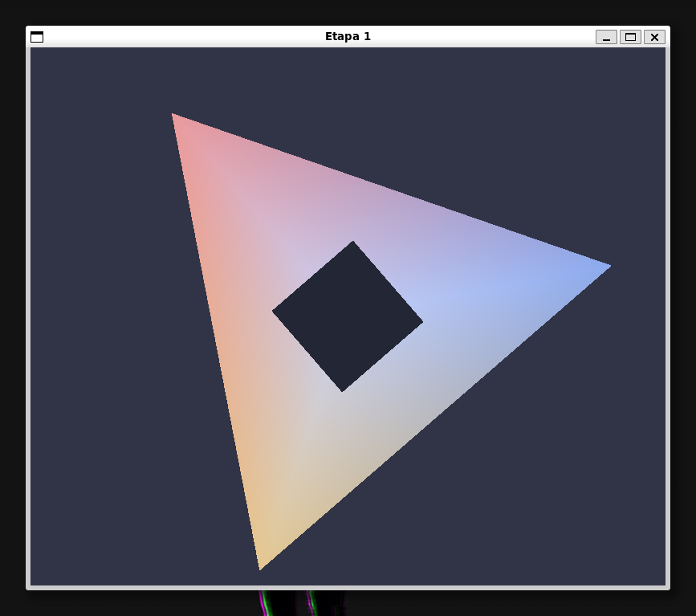
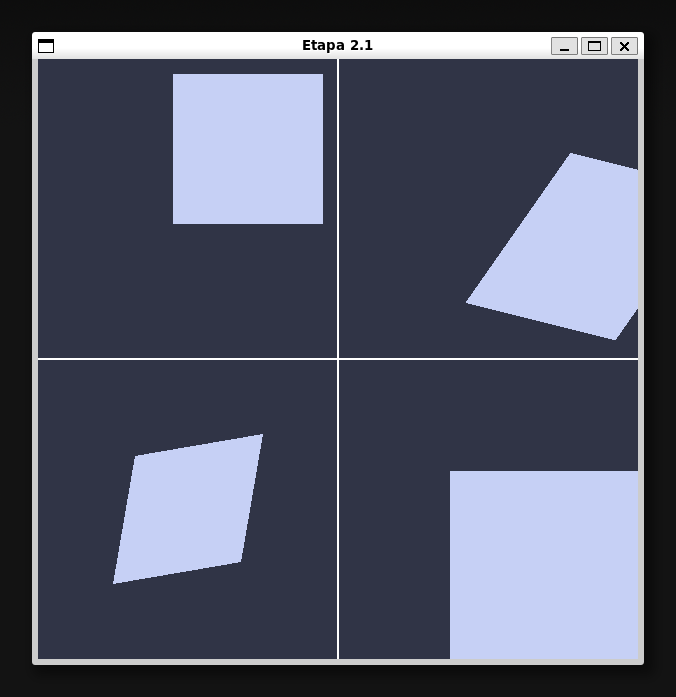
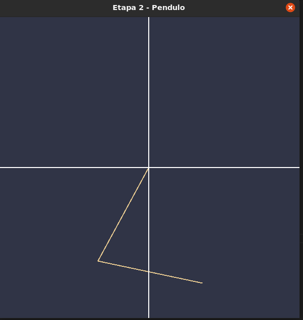
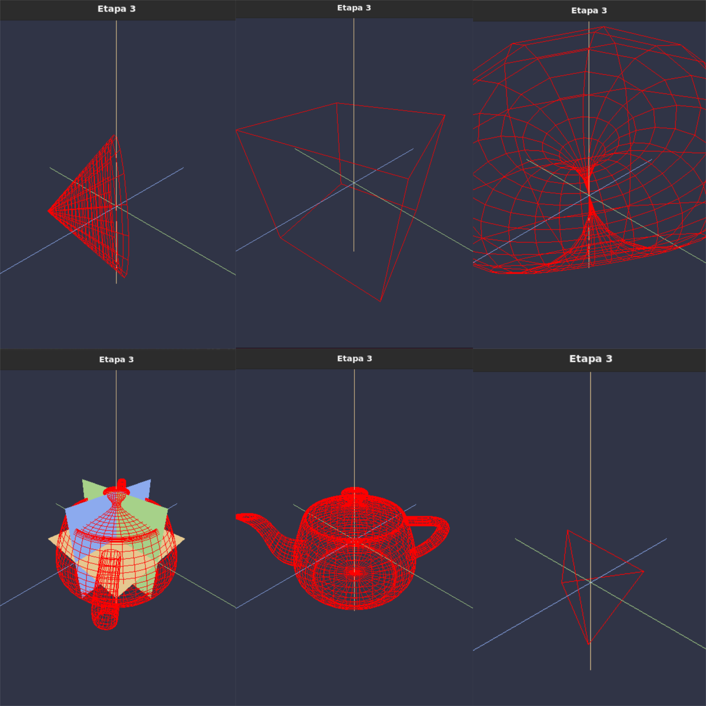
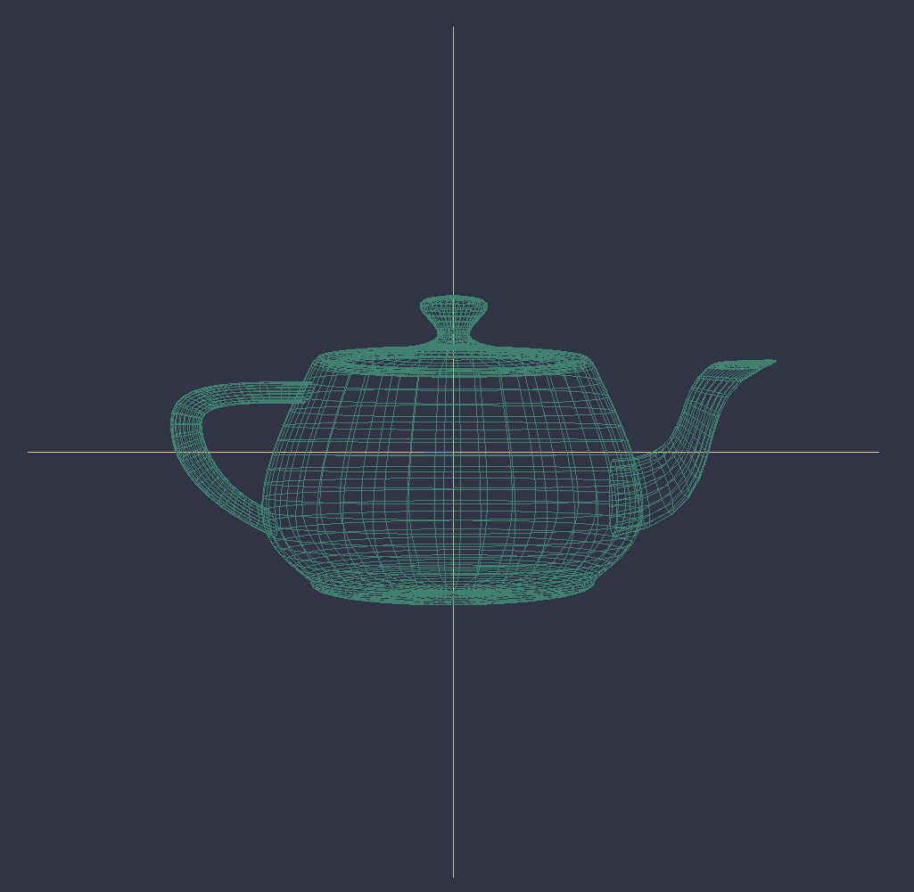
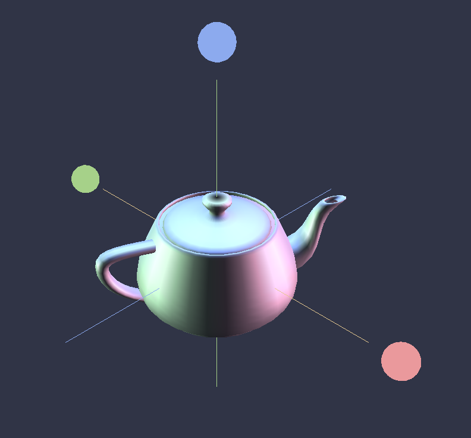
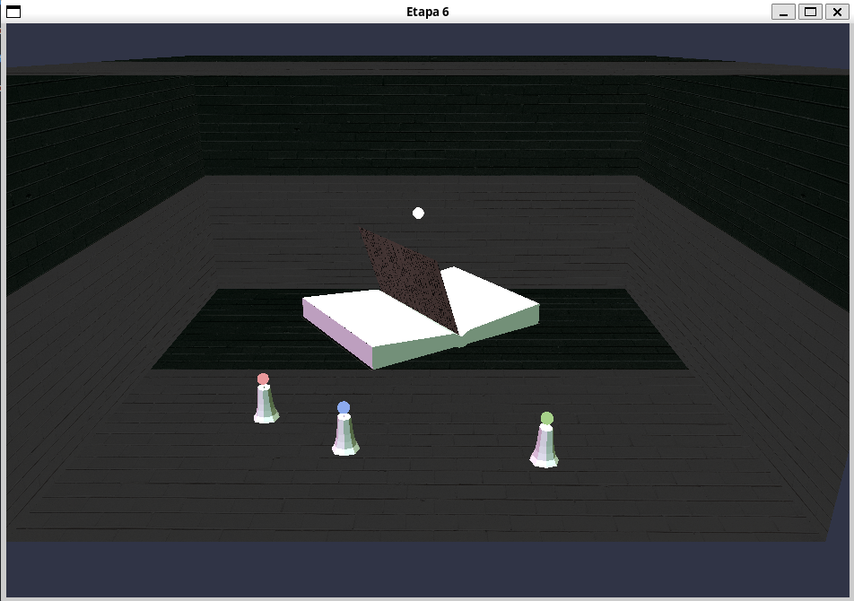
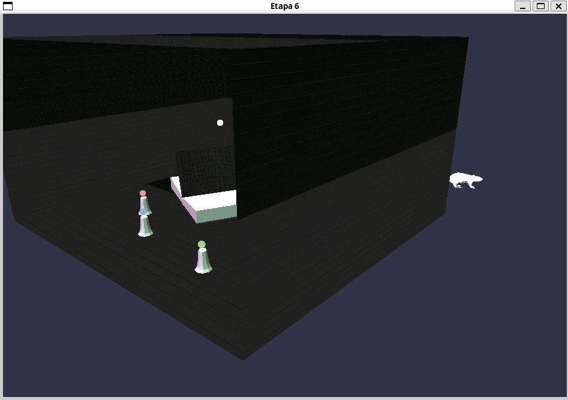
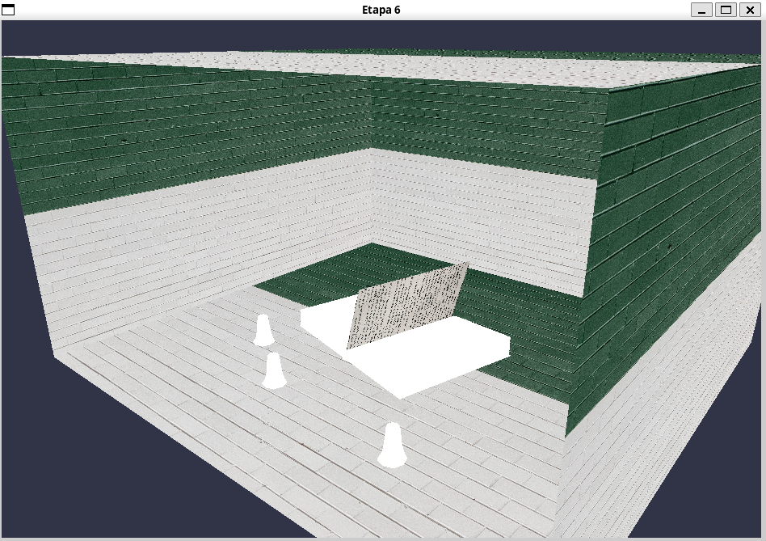

<div align="center">

  

# Proyectos OpenGL

</div>

Las practicas de la asignatura de informática gráfica consisten en la realización de una serie de etapas donde se desarrollan los conceptos básicos de los gráficos realizados por ordenador. El objetivo final es conseguir realizar una escena realista" con movimiento, objetos, iluminación y algunos extras opcionales.

## Índice

-   [Proyectos OpenGL](#proyectos-opengl)
    -   [Índice](#índice)
    -   [Desarollo](#desarollo)
    -   [Estructura del repositorio](#estructura-del-repositorio)
    -   [Etapa 1: Generación del Workspace y primer programa en Opengl mediante GLUT](#etapa-1-generación-del-workspace-y-primer-programa-en-opengl-mediante-glut)
    -   [Etapa 2: Doble buffer y escalado](#etapa-2-doble-buffer-y-escalado)
        -   [Ejemplos de transformaciones](#ejemplos-de-transformaciones)
        -   [Doble pendulo](#doble-pendulo)
    -   [Etapa 3: Escena 3D](#etapa-3-escena-3d)
    -   [Etapa 4: Movimiento de camara](#etapa-4-movimiento-de-camara)
    -   [Etapa 5: Luces materiales y sombreados](#etapa-5-luces-materiales-y-sombreados)
    -   [Etapa 6: Realismo I](#etapa-6-realismo-i)

## Desarollo

Para compilar los programas se emplea `nobuild.c`. Para ello, primero se debe de compilar este programa y después ejecutarlo:

```bash
# Si no se tiene compilado nobuild, ejecutar:
gcc -o nobuild nobuild.c

# Para compilar programas
./nobuild
```

## Estructura del repositorio

El repositorio está organizado de la siguiente manera:

```bash
└── src             # Diretorio raíz del repositorio
    ├── templates   # Contine los archivos por defecto de una etapa
    ├── Etapa1
    .
    .
    .
    └── Etapa6
```

## Etapa 1: Generación del Workspace y primer programa en Opengl mediante GLUT

<p align="center">  </p>

## Etapa 2: Doble buffer y escalado

### Ejemplos de transformaciones

<p align="center">  </p>

### Doble pendulo

<p align="center">  </p>

## Etapa 3: Escena 3D

<p align="center">  </p>

## Etapa 4: Movimiento de camara

<p align="center">  </p>

## Etapa 5: Luces materiales y sombreados

<p align="center">  </p>

## Etapa 6: Realismo I

 
 
